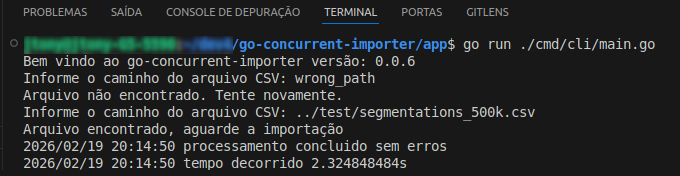

<a id="header"></a>

<center>
<a href="#header">
    
</a>
</center>

<!-- 
    icons by:
    https://devicon.dev/
    https://simpleicons.org/
-->

[](https://go.dev/) [](https://www.postgresql.org/) [](https://www.docker.com/) [](https://ubuntu.com/) [](https://github.com/spf13/viper) [](https://github.com/jtonynet) [](https://code.visualstudio.com/) [](https://cursor.com/agents) 

[](https://go.dev/)

## 🕸️ Redes

[](https://www.linkedin.com/in/jos%C3%A9-r-99896a39/) [](mailto:learningenuity@gmail.com)

---

## 📁 O Projeto

<a id="index"></a>
### ⤴️ Índice


__[Go Concurrent Importer](#header)__<br/>
  1.  ⤴️ [Índice](#index)
  2.  📖 [Sobre](#about)
  3.  💻 [Instalando](#install)
  4.  💻 [Rodando](#run)
  5.  ✅ [Testando](#tests)
  6.  🔢 [Versões](#versions)
  7.  🤖 [Uso de IA](#ia)
  8.  🏁 [Conclusão](#conclusion)

---

<br/>

<a id="about"></a>
### 📖 Sobre

>  **Cenário:**
>  - Ler um arquivo CSV com 4 colunas: user_id, segment_type, segment_name e data
>  - Este arquivo terá 1 milhão de linhas
>  - O processamento deve ser performático e otimizado
>  - Validar se os dados são válidos
>  - Salvar no banco de dados
>  - Se houver erro, mostrar ou salvar essa informação de alguma forma
>
> ---

A aplicação foi testada em Sistema Operacional `Ubuntu 22.04.4 LTS`

<br/>

[⤴️ de volta ao índice](#index)

---

<br/>

<a id="install"></a>
### 💻 Instalando

`Docker` e `Docker Compose` são necessários para rodar a aplicação de forma containerizada, e é fortemente recomendado utilizá-los para rodar o banco de dados e demais dependências localmente. Siga as instruções abaixo caso não tenha esses softwares instalados em sua máquina:

- &nbsp;&nbsp;[Instalando Docker](https://docs.docker.com/engine/install/)
- &nbsp;&nbsp;[Instalando Docker Compose](https://docs.docker.com/compose/install/)

<br/>

Crie uma copia do arquivo `./app/.env.SAMPLE` e renomeie para `./app/.env`, entao rode os seguintes comandos:

```bash
docker compose up -d
cd app
go mod tidy
```

<br/>

[⤴️ de volta ao índice](#index)

---

<br/>

<a id="run"></a>
### 💻 Rodando
Com o docker rodando e a app instalada, digite:
```bash
cd app
go run ./cmd/cli/main.go
```

<br/>

Quando o arquivo CSV for exigido informe o path adequado existente no projeto
```bash
Bem vindo ao go-concurrent-importer versão: 0.0.6 
Informe o caminho do arquivo CSV: ../test/segmentations_500k.csv
```

<br/>

<div align="center">
  
  <br/>
  <i>Importando um caminho incorreto e, em seguida, um caminho válido com 500 mil linhas</i>
</div>

<br/>

[⤴️ de volta ao índice](#index)

---

<br/>

<a id="tests"></a>
### ✅ Testando
```bash
cd app/internal/service/
go test -v -race
```

<br/>

[⤴️ de volta ao índice](#index)

---

<br/>

<a id="versions"></a>
### 🔢 Versões

As tags de versões estão sendo criadas manualmente a medida que o projeto avança. Cada tarefa é desenvolvida em uma branch a parte (Branch Based, [feature branch](https://www.atlassian.com/git/tutorials/comparing-workflows/feature-branch-workflow)) e quando finalizadas é gerada tag e mergeadas em main.

Para obter mais informações, consulte o [Histórico de Versões](./CHANGELOG.md).

<br/>

[⤴️ de volta ao Index](#index)

---

<br/>

<a id="ia"></a>
### 🤖 Uso de IA

A figura do cabeçalho nesta página foi criada com a ajuda de inteligência artificial e um mínimo de retoques e construção no Gimp [](https://www.gimp.org/)

__Os seguintes prompts foram usados para criação no  [Bing IA:](https://www.bing.com/images/create/)__

<details>
  <summary><b>Gopher Concorrendo em Maratona</b></summary>
"gophers azul, simbolo da linguagem golang com concorrendo em uma maratona, estilo cartoon, historia em quadrinhos, fundo branco chapado para facilitar remoção<b>(sic)</b>
</details>

<br/>

IA também é utilizada em minhas pesquisas e estudos como ferramenta de apoio em conjunto com a IDE Cursor [](https://cursor.com/agents)

<br/>

[⤴️ de volta ao índice](#index)

---

<br/>

<a id="conclusion"></a>
### 🏁 Conclusão

Os principais requisitos foram atendidos, mas existem pontos de melhoria evidentes que devem ser priorizados em projetos continuados.

- **Pontos de melhoria**
  - **Cobertura de testes**: aumentar consideravelmente a suíte de testes. Iniciei com testes simples na camada de `service`, porém `repository` e `handler` ainda necessitam de mais cuidado e maior cobertura.
  - **Validação**: validar os dados de `segmentations` utilizando `go-playground/validator` para maior assertividade.
  - **Idempotência**: para testes de volume, não foi considerada a idempotência nem o uso de `upserts`. É necessário direcionamento de `stakeholders` e especialistas de domínio para definição dessa estratégia.
  - **Docker**: dockerizar a aplicação para que ela fique independente da instalação local do Go.
  - **Esteira de CI**: implementação de uma esteira de `CI` com `GitHub Actions` para garantir mesclagens seguras.
  - **Esteira de CD**: envio dos `artefatos` (recomenda-se imagens `Docker` publicadas em um `Docker Registry`) para a `pipeline` de `deploy`.
  - **Sistema de logging**: adoção de um sistema de `logging` mais robusto (recomenda-se `slog` ou `zap`).

<br>

- **Desejáveis**
  - **REST API**: disponibilização de uma `API REST` para consulta dos segmentos.
  - **Modelo de dados**: definição de um modelo de dados adequado para consultas de múltiplos segmentos, considerando que existem `DTOs` específicos para diferentes tipos de segmentação. O uso de `triggers` no banco ou um modelo `CQRS` pode ser avaliado nessa etapa.
  - **Observabilidade**: adoção de ferramentas como `Prometheus`, `Grafana` e `Loki`.
  - **Teste de performance**: utilização de `Gatling` ou `K6` para validar CLI.
  - **Teste de carga**: utilização de `Gatling` ou `K6` para validar CLI.


<br/>

Este desafio me permite consolidar conhecimentos e identificar pontos cegos para aprimoramento. Continuarei trabalhando para evoluir o projeto e expandir minhas habilidades.

<br/>

[⤴️ de volta ao índice](#index)

---


<a id="footer"></a>

<br/>

>  _"Lifelong Learning & Prosper"_
> <br/> 
>  _Mr. Spock, maybe_   🖖🏾🚀

<div align="center">
<a href="#footer">

</a>
</div>
